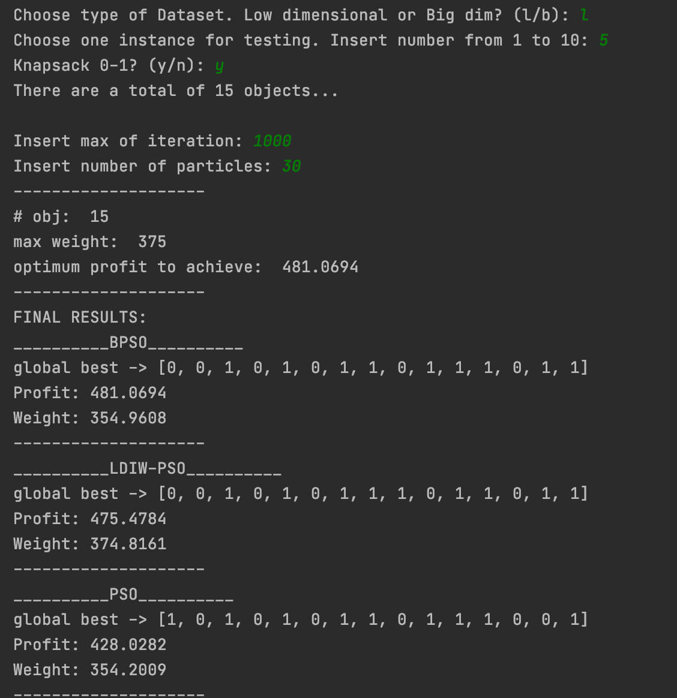
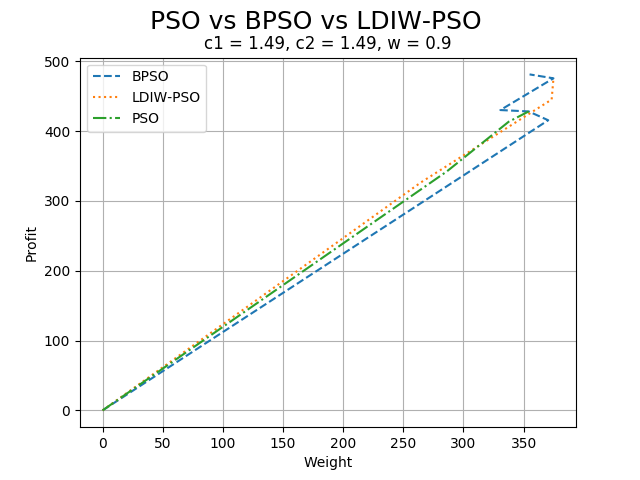
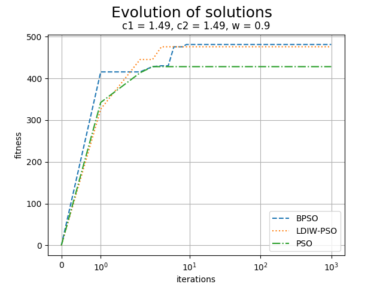

# 0-1 Knapsack Problem with PSO

The knapsack problem consists in finding the maximum profit in the choice of the items to insert in the knapsack without exceeding the specified maximum capacity.
Compare three solution with Particle Swarm Optimization, Binary PSO and linear decreasing inertia weight (LDIW-PSO)

### Program execution

